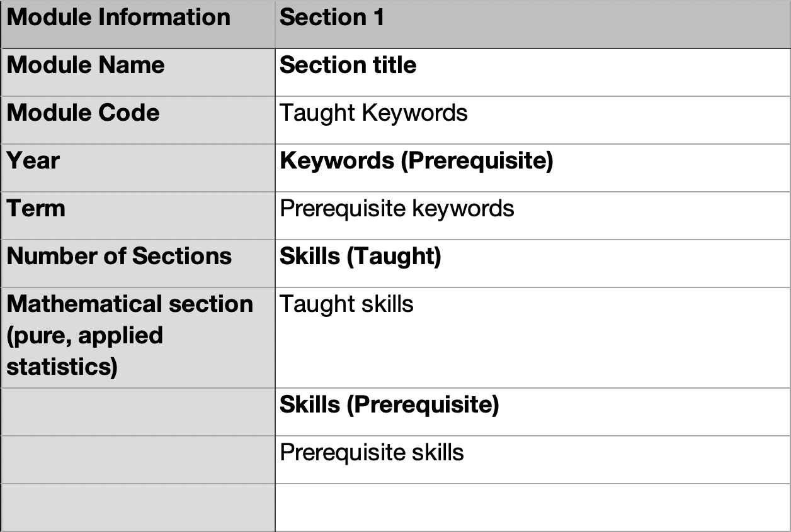

# StudentShapers Curriculum Mapping Project
## Table of Contents
1. [General Information](#general-information)
2. [Prerequisites](#prerequisites)
3. [CSV Formatting](#csv-formatting)
4. [Script for Running Code](#script-for-running-code)
5. [Score Generating](#score-generating)
### General Information
This packaged was written for the StudentShapers Curriculum Mapping Project in the Department of Mathematics at Imperial College London. 
Given information about modules (csv), this code can be used to load all the modules into one data structure and to compare the keywords in each module to all the other available modules. Keywords are split into required and taught to help establish the nature of links between modules (i.e similar or prerequisite).

### Prerequisites 
This package was written in Python 3.8

### CSV Formatting
In order to play nicely with the code that loads the module information into the data structure (JSON) that houses all the modules, the csv file for the module has to be written in a specific way. See example below


A few notes about this
1. If using a xslx or numbers file, only one sheet should be populated otherwise information will be lost when converting to csv.
2. Headings should be exactly as is shown (including capitalisation and spacing). This includes
    * Module Information
    * Section # *[Note: index starting from 1]*
    * Keywords (Prerequisite)
    * Skills (Taught)
    * Skills (Prerequisite)
3. If a term has synonyms, the syntax for handling this is `term// term` i.e term 1 followed by two forward slashes followed by a space follow by synonym for term 1 and so on.
4. We used an indexing system to handle the same word being used for different concepts which will not be included here.
5. There should be no blank cells in the column before the end of the Skills (Prerequisite)
6. Add columns for each section in the module. The total number of (populated) columns in the file should be `Number of Sections + 1` where the addition of 1 comes from the module information column.

The csv files should be saved in one folder.

### Script for Running Code
The specifics of running each function can be found in the appropriate doc string but in order to get comparison information for the modules, a python script of the following form would be the best way to go

#### Import all the files containing functions

```python
from helper_functions import *
from module_dict_updates import *
from search_file import *
from module_comparisons import *
```

#### Populate the JSON file with module information in the appropriate format 
```python 
all_modules = all_modules_dict('./module_dict.json', '/Users.../module_csv_files', './module_csv_files/%s')
```
Where the relative path to the json file replaces the first argument (with whatever you called it), similarly for the full and relative paths to the directory containing the csv files. **The %s is important!**

#### Set Parameter Values 

You can do this straight into the function but for the sake of instruction, I'll do it explicity here
```python
index1 #Takes the value 1 or 2. 1 indicates the taught keywords of module 1. 2 indicates the prerequite keywords of module 1
index2 #Takes the values 1 or 2. 1 indicates the taught keywords of module 2. 2 indicates the prerequite keywords of module 2
repeat_or_cluster #Takes the values 1 or 2. 1 indicates the similarity score based on the number of repeated keywords. 2 indicates similarity score based on 'clustering' (for details see the Score Generating section).
min_val #Takes a value between 0 and 1 (threshold for two modules to be considered similar)
max_val #Takes a value between 0 and 1 (upper limit of similarity being considered.)
write_destination = "/Users/.../results.xlsx" #Replace that with the full path to the xslx file you want to write to.

```

#### Run a Similarity Comparison

```python
similarity_all_modules(all_modules, index1, index2, repeat_or_cluster, min_val, write_destination, max_val)
```

#### (Optional) Investigate Interesting Similarity
You may find some of the apparent similarity interesting or odd. To specifically investigate this, you'd want something like

``` python 
module_dict1 = all_modules['module_code1']
module_dict2 = all_modules['module_code2']
print(is_there_overlap(module_dict1, module_dict2, index1, index2))
```
Which will a list who's last entry contains the keywords that have been repeated.

### Score Generating

For the mathematically inclined amongst you, the similarity scores are generated as follows

#### Repeated Keywords

Once the number of repeated keywords has been calculated between each module pair, this is put into a structure that resembles a symmetric matrix, and all the values are divided by the largest number found in that matrix (the largest number of repeats between any two modules).

#### Clustering of Keywords

Given that there is similarity between keywords in a module, this determines how spread out said keywords are across the modules. The way I have chosen to do this is to consider the following metrics. When comparing module i and module j
* Number of repeated keywords divided by the number of sections they're repeated across in module j
* Maximum number of repeated keywords in any given section within module j
* The number of repeated keywords in each section in module j squares and then summed over all the sections in module j.

These numbers are then weighted 1:3:3 and then normalised with respect to the largest number similarly to [Repeated Keywords](#repeated-keywords).

A matrix of the similarity scores (determined by the chosen indices - see [Set Parameter Values](#set-parameter-values)) is written to an xslx file.